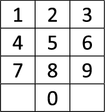

<!-- {{#title ​Динамическое программирование}} -->

<h1 align="center">Динамическое программирование</h1>

## A. Кузнечик собирает монеты

##### Ограничение по времени на тест: 2 секунды
##### Ограничение по памяти на тест: 256 мегабайт

Кузнечик прыгает по столбикам, расположенным на одной линии на равных расстояниях друг от друга. Столбики имеют порядковые номера от 1 до _n_. В начале Кузнечик сидит на столбике с номером 1 и хочет добраться до столбика с номером _n_. Он может прыгнуть вперед на расстояние от 1 до _k_ столбиков, считая от текущего.

На каждом столбике Кузнечик может получить или потерять несколько золотых монет (для каждого столбика это число известно). Определите, как нужно прыгать Кузнечику, чтобы собрать наибольшее количество золотых монет. Учитывайте, что Кузнечик не может прыгать назад.

### Входные данные
В первой строке вводятся два натуральных числа: _n_ и _k_ (3 ≤ _n_ ≤ 10 000, 1 ≤ _k_ ≤ 10 000), разделённые пробелом. Во второй строке записаны через пробел _n_ − 2 целых числа – количество монет, которое Кузнечик получает на каждом столбике, от 2-го до _n_ − 1-го. Если это число отрицательное, Кузнечик теряет монеты. Гарантируется, что все числа по модулю не превосходят 10 000.

### Выходные данные
В первой строке программа должна вывести наибольшее количество монет, которое может собрать Кузнечик. Во второй строке выводится число прыжков Кузнечика, а в третьей строке – номера всех столбиков, которые посетил Кузнечик (через пробел в порядке возрастания).

Если правильных ответов несколько, выведите любой из них.

### Пример
Входные данные
```cpp
5 3
2 -3 5
```

Выходные данные
```cpp
7
3
1 2 4 5 
```

Входные данные
```cpp
10 3
-13 -2 -14 -124 -9 -6 -5 -7
```

Выходные данные
```cpp
-16
4
1 3 6 8 10 
```

Входные данные
```cpp
12 5
-5 -4 -3 -2 -1 1 2 3 4 5
```

Выходные данные
```cpp
14
7
1 6 7 8 9 10 11 12 
```

### [Решение](A.cpp)


## B. Черепаха и монеты

##### Ограничение по времени на тест: 2 секунды
##### Ограничение по памяти на тест: 256 мегабайт

Черепаха хочет переползти из левого верхнего угла поля размером _n_ на _m_ клеток (2 ≤ _n_,_m_ ≤ 1000) в правый нижний. За один шаг она может переместиться на соседнюю клетку вправо или на соседнюю клетку вниз. Кроме того, проходя через каждую клетку, Черепаха получает (или теряет) несколько золотых монет (это число известно для каждой клетки).

### Входные данные
В первой строке вводятся два натуральных числа: _n_ и _m_ (2 ≤ _n_,_m_ ≤ 1000), разделённые пробелом. В каждой из следующих _n_ строк записаны через пробел по _m_ чисел _aij_ (|_aij_| ≤ 10), которые обозначают количество монет, получаемых Черепашкой при проходе через каждую клетку. Если это число отрицательное, Черепашка теряет монеты.

### Выходные данные
В первой строке программа должна вывести наибольшее количество монет, которое может собрать Черепаха. Во второй строке без пробелов выводятся команды, которые нужно выполнить Черепахе: буква `R` (от слова `right`) обозначает шаг вправо, а буква `D` (от слова `down`) — шаг вниз.

### Пример
Входные данные
```cpp
3 3
0 2 -3
2 -5 7
1 2 0
```

Выходные данные
```cpp
6
RRDD
```

Входные данные
```cpp
4 5
4 5 3 2 9
4 6 7 5 9
5 2 5 -3 -10
3 5 2 9 3
```

Выходные данные
```cpp
41
RDRDDRR
```

### [Решение](B.cpp)


## C. Наибольшая возрастающая подпоследовательность

##### Ограничение по времени на тест: 2 секунды
##### Ограничение по памяти на тест: 256 мегабайт

Пусть _a1_, _a2_, _..._, _an_ — числовая последовательность. Длина последовательности — это количество элементов этой последовательности. Последовательность _ai1_, _ai2_, _..._, _aik_ называется подпоследовательностью последовательности _a_, если 1 ≤ _i1_ < _i2_ < ... < _ik_ ≤ _n_. Последовательность _a_ называется возрастающей, если _a1_ < _a2_ < ... < _an_.

Вам дана последовательность, содержащая n целых чисел. Найдите ее самую длинную возрастающую подпоследовательность.

### Входные данные
В первой строке задано одно число _n_ (1 ≤ _n_ ≤ 2000) — длина подпоследовательности. В следующей строке задано _n_ целых чисел _ai_ ( - 10^9 ≤ _ai_ ≤ 10^9) — элементы последовательности.

### Выходные данные
В первой строке выведите число _k_ — длину наибольшей возрастающей подпоследовательности. В следующей строке выведите _k_ чисел — саму подпоследовательность.

### Пример
Входные данные
```cpp
8
1 4 1 5 3 3 4 2
```

Выходные данные
```cpp
3
1 4 5 
```

Входные данные
```cpp
3
1 2 3
```

Выходные данные
```cpp
3
1 2 3 
```

### [Решение](C.cpp)


## D. Ход конем

##### Ограничение по времени на тест: 1 секунда
##### Ограничение по памяти на тест: 256 мегабайт

Шахматная ассоциация решила оснастить всех своих сотрудников такими телефонными номерами, которые бы набирались на кнопочном телефоне ходом коня. Например, ходом коня набирается телефон 340-49-27. При этом телефонный номер не может начинаться ни с цифры 0, ни с цифры 8.

<div align="center"></div>

Напишите программу, определяющую количество телефонных номеров длины _n_, набираемых ходом коня. Поскольку таких номеров может быть очень много, выведите ответ по модулю 10^9.

### Входные данные
Во входном файле записано целое число _n_ (1 ≤ _n_ ≤ 100).

### Выходные данные
Выведите в выходной файл искомое количество телефонных номеров по модулю 10^9.

### Пример
Входные данные
```cpp
1
```

Выходные данные
```cpp
8
```

Входные данные
```cpp
2
```

Выходные данные
```cpp
16
```

### [Решение](D.cpp)


## E. Расстояние по Левенштейну

##### Ограничение по времени на тест: 2 секунды
##### Ограничение по памяти на тест: 256 мегабайт

Дана текстовая строка. С ней можно выполнять следующие операции:
1. Заменить один символ строки на другой символ.
2. Удалить один произвольный символ.
3. Вставить произвольный символ в произвольное место строки.

Например, при помощи первой операции из строки «СОК» можно получить строку «СУК», при помощи второй операции — строку «ОК», при помощи третьей операции — строку «СТОК».

Минимальное количество таких операций, при помощи которых можно из одной строки получить другую, называется стоимостью редактирования или расстоянием Левенштейна.

Определите расстояние Левенштейна для двух данных строк.

### Входные данные
Программа получает на вход две строки, длина каждой из которых не превосходит 1000 символов, строки состоят только из заглавных латинских букв.

### Выходные данные
Требуется вывести одно число — расстояние Левенштейна для данных строк.

### Пример
Входные данные
```
ABCDEFGH
ACDEXGIH
```

Выходные данные
```cpp
3
```

### [Решение](E.cpp)


## F. Кафе

##### Ограничение по времени на тест: 2 секунды
##### Ограничение по памяти на тест: 64 мегабайта

Около Петиного университета недавно открылось новое кафе, в котором действует следующая система скидок: при каждой покупке более чем на 100 рублей покупатель получает купон, дающий право на один бесплатный обед (при покупке на сумму 100 рублей и меньше такой купон покупатель не получает).

Однажды Пете на глаза попался прейскурант на ближайшие _n_ дней. Внимательно его изучив, он решил, что будет обедать в этом кафе все _n_ дней, причем каждый день он будет покупать в кафе ровно один обед. Однако стипендия у Пети небольшая, и поэтому он хочет по максимуму использовать предоставляемую систему скидок так, чтобы его суммарные затраты были минимальны. Требуется найти минимально возможную суммарную стоимость обедов и номера дней, в которые Пете следует воспользоваться купонами.

### Входные данные
В первой строке входного файла записано целое число _n_ (0 ≤ _n_ ≤ 100). В каждой из последующих n строк записано одно целое число, обозначающее стоимость обеда в рублях на соответствующий день. Стоимость — неотрицательное целое число, не превосходящее 300.

### Выходные данные
В первой строке выдайте минимальную возможную суммарную стоимость обедов. Во второй строке выдайте два числа _k1_ и _k2_ — количество купонов, которые останутся неиспользованными у Пети после этих n дней и количество использованных им купонов соответственно.

В последующих _k2_ строках выдайте в возрастающем порядке номера дней, когда Пете следует воспользоваться купонами. Если существует несколько решений с минимальной суммарной стоимостью, то выдайте то из них, в котором значение _k1_ максимально (на случай, если Петя когда-нибудь ещё решит заглянуть в это кафе). Если таких решений несколько, выведите любое из них.

### Пример
Входные данные
```cpp
5
110
40
120
110
60
```

Выходные данные
```cpp
260
0 2
3
5
```

Входные данные
```cpp
3
110
110
110
```

Выходные данные
```cpp
220
1 1
2
```

### [Решение](F.cpp)


## G. Удаление скобок 2.0

##### Ограничение по времени на тест: 2 секунды
##### Ограничение по памяти на тест: 256 мегабайт

Около Петиного университета недавно открылось новое кафе, в котором действует следующая система скидок: при каждой покупке более чем на 100 рублей покупатель получает купон, дающий право на один бесплатный обед (при покупке на сумму 100 рублей и меньше такой купон покупатель не получает).

Однажды Пете на глаза попался прейскурант на ближайшие _n_ дней. Внимательно его изучив, он решил, что будет обедать в этом кафе все _n_ дней, причем каждый день он будет покупать в кафе ровно один обед. Однако стипендия у Пети небольшая, и поэтому он хочет по максимуму использовать предоставляемую систему скидок так, чтобы его суммарные затраты были минимальны. Требуется найти минимально возможную суммарную стоимость обедов и номера дней, в которые Пете следует воспользоваться купонами.

### Входные данные
В первой строке входного файла записано целое число _n_ (0 ≤ _n_ ≤ 100). В каждой из последующих n строк записано одно целое число, обозначающее стоимость обеда в рублях на соответствующий день. Стоимость — неотрицательное целое число, не превосходящее 300.

### Выходные данные
В первой строке выдайте минимальную возможную суммарную стоимость обедов. Во второй строке выдайте два числа _k1_ и _k2_ — количество купонов, которые останутся неиспользованными у Пети после этих n дней и количество использованных им купонов соответственно.

В последующих _k2_ строках выдайте в возрастающем порядке номера дней, когда Пете следует воспользоваться купонами. Если существует несколько решений с минимальной суммарной стоимостью, то выдайте то из них, в котором значение _k1_ максимально (на случай, если Петя когда-нибудь ещё решит заглянуть в это кафе). Если таких решений несколько, выведите любое из них.

### Пример
Входные данные
```
([)]
```

Выходные данные
```
[]
```

### [Решение](G.cpp)


## H. Продавец аквариумов

##### Ограничение по времени на тест: 1 секунды
##### Ограничение по памяти на тест: 256 мегабайт

Продавец аквариумов для кошек хочет объехать _n_ городов, посетив каждый из них ровно один раз. Помогите ему найти кратчайший путь.

<div align="center"></div>

### Входные данные
Первая строка входного файла содержит натуральное число _n_ (1 ⩽ _n_ ⩽ 13) — количество городов. Следующие _n_ строк содержат по _n_ чисел — длины путей между городами.

В _i_-й строке _j_-е число — _aij_ — это расстояние между городами _i_ и _j_ (0 ⩽ _aij_ ⩽ 10^6; _aij_ = _aji_; _aii_ = 0).

### Выходные данные
В первой строке выходного файла выведите длину кратчайшего пути. Во второй строке выведите _n_ чисел — порядок, в котором нужно посетить города.

### Пример
Входные данные
```cpp
5
0 183 163 173 181
183 0 165 172 171
163 165 0 189 302
173 172 189 0 167
181 171 302 167 0
```

Выходные данные
```cpp
666
4 5 2 3 1 
```

### [Решение](H.cpp)


## I. Замощение доминошками

##### Ограничение по времени на тест: 1 секунда
##### Ограничение по памяти на тест: 256 мегабайт

Вам дана прямоугольная сетка из квадратных ячеек. Символ `X` представляет собой уже покрытую ячейку, символ `.` - это ячейка, которую еще нужно покрыть.

Вы хотите покрыть все ячейки `.`, непересекающимися доминошками 2 × 1. Найдите количество способов сделать это. Два способа считаются различными, если две ячейки покрыты одним и тем же домино в одном замощении и двумя разными домино в другом замощении.

### Входные данные
Первая строка содержит числа _n_ и _m_ (1 ≤ _n_,_m_ ≤ 12). Следующие _n_ строк содержат по _m_ символов — описание доски.

### Выходные данные
Выведите число замощений доминошками.

### Пример
Входные данные
```
2 2
..
..
```

Выходные данные
```cpp
2
```

Входные данные
```
3 3
...
.X.
...
```

Выходные данные
```cpp
2
```

Входные данные
```
3 3
...
...
..X
```

Выходные данные
```cpp
4
```

### [Решение](I.cpp)


## J. Симпатичные узоры

##### Ограничение по времени на тест: 2 секунды
##### Ограничение по памяти на тест: 256 мегабайт

Компания *BrokenTiles* планирует заняться выкладыванием во дворах у состоятельных клиентов узор из черных и белых плиток, каждая из которых имеет размер 1 × 1 метр. Известно, что дворы всех состоятельных людей имеют наиболее модную на сегодня форму прямоугольника _n_ × _m_ метров.

Однако при составлении финансового плана у директора этой организации появилось целых две серьезных проблемы: во первых, каждый новый клиент очевидно захочет, чтобы узор, выложенный у него во дворе, отличался от узоров всех остальных клиентов этой фирмы, а во вторых, этот узор должен быть симпатичным.

Как показало исследование, узор является симпатичным, если в нем нигде не встречается квадрата 2 × 2 метра, полностью покрытого плитками одного цвета.

Для составления финансового плана директору необходимо узнать, сколько клиентов он сможет обслужить, прежде чем симпатичные узоры данного размера закончатся. Помогите ему!

### Входные данные
На первой строке входного файла находятся два натуральных числа _n_ и _m_. 1 ≤ _n_ ⋅ _m_ ≤ 30.

### Выходные данные
Выведите в выходной файл единственное число — количество различных симпатичных узоров, которые можно выложить во дворе размера _n_ × _m_. Узоры, получающиеся друг из друга сдвигом, поворотом или отражением считаются различными.

### Пример
Входные данные
```cpp
1 1
```

Выходные данные
```cpp
2
```

Входные данные
```cpp
1 2
```

Выходные данные
```cpp
2
```

### [Решение](J.cpp)


## K. Мультирюкзак

##### Ограничение по времени на тест: 1 секунда
##### Ограничение по памяти на тест: 256 мегабайт

Один рюкзак может вместить предметы с суммарным весом не более _s_ (1 ≤ _s_ ≤ 10^8). Есть _n_ предметов, с весами _wi_ (1 ≤ _wi_ ≤ _s_).

Найдите способ разместить предметы в минимальное число рюкзаков.

### Входные данные
Первая строка содержит два целых числа _n_ и _s_ (1 ≤ _n_ ≤ 18; 1 ≤ _s_ ≤ 10^8).

Следующие _n_ строк содержат веса предметов _wi_ (1 ≤ _wi_ ≤ _s_).

### Выходные данные
Первая строка должна содержать число _k_ — минимально число рюкзаков.

Каждая из следующих _k_ строк описывает один рюкзак. Строка начинается с количества предметов, далее содержатся номера коров.

### Пример
Входные данные
```cpp
4 10
5
6
3
7
```

Выходные данные
```cpp
3
2 1 3
1 2
1 4
```

### [Решение](K.cpp)
